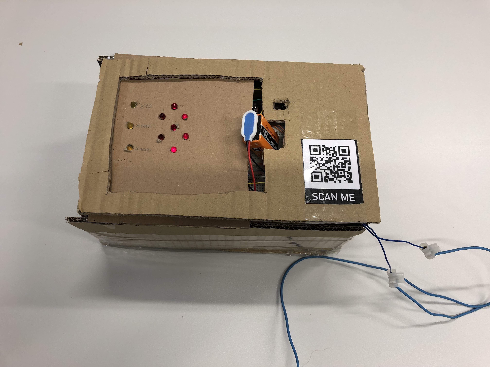

## Metalldetektor

Dies ist die digitale Bedienungsanleitung des Metall Detektors.

## Verwendung

- Schließen Sie die 9V Batterie an.
- Der Metalldetektor beginnt von 3 herunterzuzählen.
- Sobald die 0 erscheint, kalibiert sich der Metalldetektor.
- Anschließend misst der Metalldetektor das Metall in der Nähe der Spule und gibt die Differenzfrequenz kontinuierlich aus.

## Anzeige lesen

Die Anzeige besteht aus zwei Teilen. Auf der linken Seite gibt es drei Multiplikations LEDs und auf der rechten Seite eine [Siebensegmentanzeige](https://de.wikipedia.org/wiki/Segmentanzeige).

Die Siebensegmentanzeige zeigt immer die höchstwertige Ziffer an.

Die Multiplikations LEDs funktionieren folgendermaßen:

- Positive Zahlen
    - keine LED leuchtet: x1
    - oberste LED leuchtet: x10
    - mittlere LED leuchtet: x100
    - unterste LED leuchtet: x1000
- Negative Zahlen
    - alle LEDs leuchten: x-1
    - oberste LED leuchtet nicht: x-10
    - mittlere LED leuchtet nicht: x-100
    - unterste LED leuchtet nicht: x-1000

## Neu Kalibrieren

Zum neu kalibrieren muss der Reset-Knopf am Arduino gedrück werden. Anschließend zählt der Metalldetektor erneut von drei runter und kalibiert sich anschließend.

## Support

Bei Fragen und für Hilfe, melden Sie sich bei [metall-support@noahpeeters.de](mailto:metall-support@noahpeeters.de).
